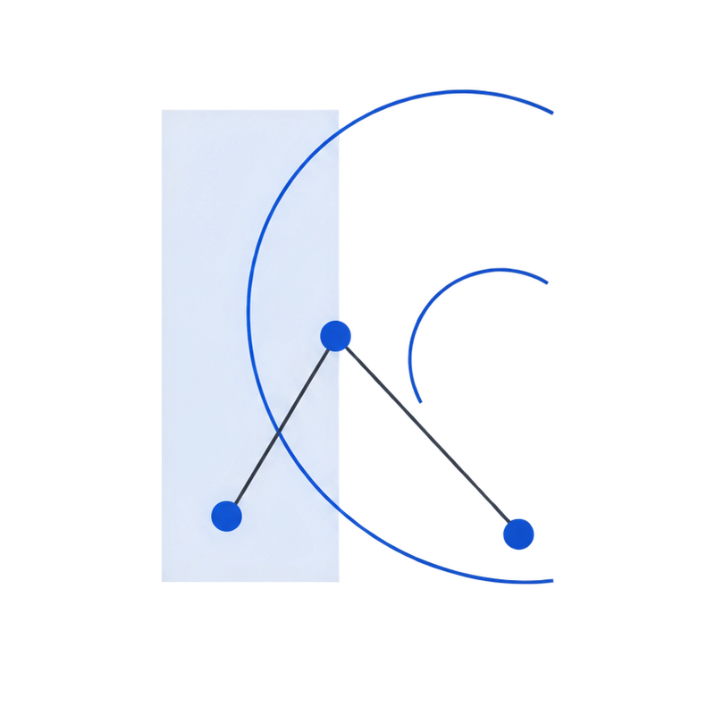

<!-- _class: title -->

# 通用学术演示主题

## Editorial Blue：理性、编辑感、可信



报告人姓名

报告日期

单位名称 · 部门名称

---

# 首页使用说明

<div class="info-box">本演示中的姓名、机构、方法名称和指标均为版式占位内容，不代表真实研究结论或来源。</div>

## 首页结构

- 页面开头添加 `<!-- _class: title -->`
- `# 主标题` 左对齐显示，并允许自然换行
- `## 副标题` 作为标题上方的导语显示
- 后续三个段落依次放置报告人、日期和单位信息

---

<!-- _class: toc -->

# 目录

- 基础文本样式与表格
- 多栏布局展示
- 图文混排与时间轴
- 章节分隔与引用页
- 大数字展示
- 实用工具类

---

# 基础文本样式

## 文本强调

- **粗体文本** 使用钴蓝强调
- *斜体文本* 使用同色下划线形成语境强调
- `行内代码` 有灰色背景
- <mark>高亮文本</mark> 有黄色背景

## 引用块

> 这是一段引用文字，左侧有主色调边框。
> 引用常用于展示重要观点或他人言论。

---

# 列表展示

## 无序列表

- 第一项内容
- 第二项内容
  - 嵌套子项 A
  - 嵌套子项 B
- 第三项内容

## 有序列表

1. 步骤一：准备数据
2. 步骤二：训练模型
3. 步骤三：评估结果

---

# 学术三线表

<div class="table-emphasis">

| 方法 | 准确率 | 召回率 | F1 分数 |
|:-----|-------:|-------:|--------:|
| 方法 A | 92.3% | 89.1% | 90.7% |
| 方法 B | 94.5% | 91.2% | 92.8% |
| 方法 C | 93.1% | 93.8% | 93.4% |
| **本文方法** | **96.2%** | **95.1%** | **95.6%** |

</div>

表格采用现代三线表风格；数值列右对齐，并用 `table-emphasis` 显式突出加粗结果行。

---

# 数学公式

## 行内公式

爱因斯坦质能方程 $E = mc^2$ 揭示了质量与能量的关系。

## 块级公式

贝叶斯公式：

$$P(A|B) = \frac{P(B|A) \cdot P(A)}{P(B)}$$

多行公式：

$$
\begin{aligned}
\nabla \cdot \mathbf{E} &= \frac{\rho}{\varepsilon_0} \\
\nabla \times \mathbf{B} &= \mu_0 \mathbf{J} + \mu_0 \varepsilon_0 \frac{\partial \mathbf{E}}{\partial t}
\end{aligned}
$$

---

# 两栏布局 (columns-2)

<div class="columns-2">
<div>

### 优势分析

- 训练速度快
- 内存占用低
- 易于部署
- 支持增量学习

</div>
<div>

### 局限性

- 精度略低于大模型
- 需要特定优化
- 泛化能力有限

</div>
</div>

**使用方法**：`<div class="columns-2">` 包裹两个直接子 `<div>`；普通多栏默认使用无卡片的编辑式细线布局。

---

# 三栏布局 (columns-3)

<div class="columns-3">
<div>

### 数据收集

- 多源数据采集
- 数据清洗
- 标注验证

</div>
<div>

### 模型训练

- 特征工程
- 超参数调优
- 交叉验证

</div>
<div>

### 部署应用

- 模型压缩
- 服务封装
- 监控告警

</div>
</div>

**使用方法**：`<div class="columns-3">` 包裹 3 个 `<div>`，每列自动配色。

---

# 四栏布局 (columns-4)

<div class="columns-4">
<div>

### Q1

- 需求分析
- 技术调研
- 原型设计

</div>
<div>

### Q2

- 核心开发
- 单元测试
- 代码审查

</div>
<div>

### Q3

- 集成测试
- 性能优化
- 文档编写

</div>
<div>

### Q4

- 用户测试
- 问题修复
- 正式发布

</div>
</div>

**使用方法**：`<div class="columns-4">` 包裹 4 个 `<div>`，适合展示流程或对比。

---

# 2x2 网格布局 (columns-2x2)

<div class="columns-2x2">
<div>

### 高精度

准确率达到 96%+

</div>
<div>

### 高效率

推理速度提升 3 倍

</div>
<div>

### 低成本

训练资源减少 40%

</div>
<div>

### 易扩展

模块化设计

</div>
</div>

**使用方法**：`<div class="columns-2x2">` 包裹 4 个 `<div>`，自动排列为 2 行 2 列。

---

# 强调型两栏布局 (columns-2-colors)

<div class="columns-2-colors">
<div>

### 传统方法

- 依赖人工特征工程
- 需要领域专家知识
- 泛化能力有限

</div>
<div>

### 深度学习方法

- 自动学习特征表示
- 端到端训练
- 强大的泛化能力

</div>
</div>

**使用方法**：`<div class="columns-2-colors">`，两栏使用钴蓝与冷灰浅底进行对比。
适合对比展示（如 Before/After、优点/缺点）。

---

# 强调型三栏布局 (columns-3-colors)

<div class="columns-3-colors">
<div>

### 输入层

接收原始数据，预处理和归一化。

</div>
<div>

### 隐藏层

多层非线性变换，提取深层特征。

</div>
<div>

### 输出层

生成最终预测，支持多任务。

</div>
</div>

**使用方法**：`<div class="columns-3-colors">`，三栏使用同一冷色体系的不同明度。
适合展示流程、阶段或层次结构。

---

# 实用工具类 - 强调框

<div class="highlight">

**提示**：黄色高亮框 `.highlight`

</div>

<div class="info-box">

**信息**：蓝色信息框 `.info-box`

</div>

<div class="warning-box">

**警告**：红色警告框 `.warning-box`

</div>

<div class="success-box">

**成功**：绿色成功框 `.success-box`

</div>

**使用方法**：`<div class="highlight">内容</div>`

---

# 实用工具类 - 标签

## 分类标签

<div class="tag-group">

<span class="tag tag-primary">深度学习</span>
<span class="tag tag-accent">计算机视觉</span>
<span class="tag tag-success">已完成</span>
<span class="tag tag-warning">进行中</span>
<span class="tag tag-info">待审核</span>

</div>

## 特殊标签

<div class="tag-group">

<span class="tag tag-aug">数据增强</span>
<span class="tag tag-loss">损失函数</span>

</div>

**使用方法**：`<span class="tag tag-primary">文本</span>`
可选：`tag-primary` `tag-accent` `tag-success` `tag-warning` `tag-info`

---

# 代码展示

## Python 代码示例

```python
import torch
import torch.nn as nn

class SimpleModel(nn.Module):
    def __init__(self, input_dim, hidden_dim, output_dim):
        super().__init__()
        self.fc1 = nn.Linear(input_dim, hidden_dim)
        self.fc2 = nn.Linear(hidden_dim, output_dim)

    def forward(self, x):
        x = torch.relu(self.fc1(x))
        return self.fc2(x)
```

---

<!-- _class: small-text -->

# 小字体页面 (small-text)

**使用方法**：在页面开头添加 `<!-- _class: small-text -->`，正文字体变为 18pt。

| 参数名 | 类型 | 默认值 | 说明 |
|:-------|:-----|------:|:-----|
| learning_rate | float | 0.001 | 学习率，控制参数更新步长 |
| batch_size | int | 32 | 批次大小，影响内存和收敛 |
| num_epochs | int | 100 | 训练轮数 |
| dropout | float | 0.5 | Dropout 比例，防止过拟合 |
| weight_decay | float | 1e-4 | L2 正则化系数 |

---

<!-- _class: tinytext -->

# 超小字体页面 (tinytext)

**使用方法**：在页面开头添加 `<!-- _class: tinytext -->`，正文字体变为 16pt，适合参考文献。

## 参考文献

- [1] Vaswani, A., et al. "Attention is all you need." Advances in neural information processing systems 30 (2017).
- [2] Devlin, J., et al. "BERT: Pre-training of deep bidirectional transformers for language understanding." arXiv preprint arXiv:1810.04805 (2018).
- [3] Brown, T., et al. "Language models are few-shot learners." Advances in neural information processing systems 33 (2020): 1877-1901.
- [4] He, K., et al. "Deep residual learning for image recognition." CVPR (2016): 770-778.
- [5] Dosovitskiy, A., et al. "An image is worth 16x16 words: Transformers for image recognition at scale." ICLR (2021).

> 以上文献均为深度学习领域的经典论文，建议深入阅读。

---

# 文本对齐工具类

<div class="text-center">

### 居中标题

这段文字居中显示，使用 `.text-center` 类。

</div>

<div class="text-right">

右对齐文字，使用 `.text-right` 类。

</div>

<div class="text-left">

左对齐文字（默认），使用 `.text-left` 类。

</div>

---

# 字体大小工具类

<p class="text-sm">小号字体 (.text-sm) - 适合备注说明</p>

<p>正常字体 - 默认大小</p>

<p class="text-lg">大号字体 (.text-lg) - 适合强调内容</p>

<p class="text-xl">超大字体 (.text-xl) - 适合重点突出</p>

---

<!-- _class: small-text -->

# 快速参考 - 页面类型

| 功能 | 用法 |
|------|------|
| 首页 | `<!-- _class: title -->` |
| 目录页 | `<!-- _class: toc -->` |
| 致谢页 | `<!-- _class: thanks -->` |
| 章节分隔 | `<!-- _class: section-divider -->` |
| 引用页 | `<!-- _class: quote -->` + `> 引用内容` |
| 小字体 | `<!-- _class: small-text -->` |
| 超小字体 | `<!-- _class: tinytext -->` |

---

<!-- _class: small-text -->

# 快速参考 - 多栏与网格

| 功能 | 用法 |
|------|------|
| 两栏布局 | `<div class="columns-2">` + 2 个 `<div>` |
| 三栏布局 | `<div class="columns-3">` + 3 个 `<div>` |
| 四栏布局 | `<div class="columns-4">` + 4 个 `<div>` |
| 2x2 网格 | `<div class="columns-2x2">` + 4 个 `<div>` |
| 强调型两栏 | `<div class="columns-2-colors">` + 2 个 `<div>` |
| 强调型三栏 | `<div class="columns-3-colors">` + 3 个 `<div>` |

---

<!-- _class: small-text -->

# 快速参考 - 图文与叙事组件

| 功能 | 用法 |
|------|------|
| 图文混排 | `img-left` 或 `img-right` + 两个 `<div>` |
| 时间轴 | `timeline` 或 `timeline-horizontal` + 多个 `<div>` |
| 大数字 | `<div class="big-number">` + `.number` `.unit` `.label` |
| 语义提示 | `highlight`、`info-box`、`warning-box`、`success-box` |
| 标签组 | `tag-group` + 多个 `tag` |

---

# CSS 变量系统

改进后的主题使用统一的 CSS 变量：

```css
:root {
  /* 主色调 */
  --color-primary: #2457a7;   /* 钴蓝 */
  --color-accent: #2457a7;    /* 单一强调色 */
  --color-text: #1f2933;      /* 墨色 */
  --color-bg: #f7f8f5;        /* 暖灰纸面 */

  /* 字体 */
  --font-heading: "CMU Bright", ...;
  --font-body: "Aptos", "PingFang SC", sans-serif;

  /* 尺寸 */
  --font-size-base: 20pt;
  --font-size-h1: 36pt;
}
```

可通过修改变量快速切换整体配色。

---

<!-- _class: section-divider -->

# 第三部分

## 新增布局展示

以下展示论文和讲座常用的新布局

---

# 图文混排 - 左图右文 (img-left)

<div class="img-left">
<div>


</div>
<div>

### 模型架构

本文提出的模型包含以下组件：

- **编码器**：提取输入特征
- **注意力层**：捕获长距离依赖
- **解码器**：生成输出序列

模型参数量仅为 12M，推理速度快。

</div>
</div>

**使用方法**：`<div class="img-left"><div>图片</div><div>文字</div></div>`

---

# 图文混排 - 右图左文 (img-right)

<div class="img-right">
<div>

### 实验结果分析

从右图可以看出：

1. 本文方法在所有数据集上均表现最优
2. 随着数据量增加，优势更加明显
3. 收敛速度比基线方法快 2 倍

**结论**：所提方法具有良好的泛化性能。

</div>
<div>


</div>
</div>

**使用方法**：`<div class="img-right"><div>文字</div><div>图片</div></div>`

---

# 垂直时间轴 (timeline)

<div class="timeline">
<div>
<span class="year">2020</span>

### 项目启动

完成需求分析和技术调研

</div>
<div>
<span class="year">2021</span>

### 原型开发

完成核心算法实现和初步验证

</div>
<div>
<span class="year">2022</span>

### 系统优化

性能优化和大规模测试

</div>
<div>
<span class="year">2023</span>

### 正式发布

产品上线并获得广泛应用

</div>
</div>

---

<!-- _class: timeline-centered -->

# 水平时间轴 (timeline-horizontal)

<div class="timeline-horizontal">
<div>
<span class="year">数据准备</span>

### 收集与清洗

采集多源数据

</div>
<div>
<span class="year">模型训练</span>

### 迭代与调优

迭代优化参数

</div>
<div>
<span class="year">性能评估</span>

### 测试与复核

全面性能验证

</div>
<div>
<span class="year">上线部署</span>

### 发布与监控

生产环境应用

</div>
</div>

**使用方法**：`<div class="timeline-horizontal">` + 多个 `<div>`，每个包含 `.year` 和内容

---

# 大数字展示 (big-number)

<div class="big-number">
<div>
<span class="number">96.2<span class="unit">%</span></span>
<div class="label">准确率</div>
</div>
<div>
<span class="number accent">3.5<span class="unit">x</span></span>
<div class="label">速度提升</div>
</div>
<div>
<span class="number">12<span class="unit">M</span></span>
<div class="label">模型参数</div>
</div>
</div>

**使用方法**：`.number` 显示大数字，`.unit` 显示单位，`.label` 显示说明
添加 `.accent` 可使用主题强调色；颜色不变，便于保持统计口径一致

---

# 大数字卡片 (big-number cards)

<div class="big-number cards">
<div>
<span class="number">500<span class="unit">+</span></span>
<div class="label">合作机构</div>
</div>
<div>
<span class="number accent">10<span class="unit">万</span></span>
<div class="label">服务用户</div>
</div>
<div>
<span class="number">99.9<span class="unit">%</span></span>
<div class="label">系统可用性</div>
</div>
</div>

**使用方法**：添加 `.cards` 类显示带边框的卡片样式

---

<!-- _class: quote -->

> 可靠结论应同时说明证据、成立条件与可能失效的边界。

版式示例（非真实引文）

---

# 引用页使用说明

**引用页结构** (`<!-- _class: quote -->`):

```markdown
<!-- _class: quote -->

> 引用的文字内容
> 可以多行

作者姓名
```

- `> 引用内容` → 大字体居中显示，带装饰引号
- 下方段落 → 自动添加短引导线，显示为作者或来源

适合展示名人名言、重要结论或核心观点。

---

<!-- _class: section-divider -->

# 实验结果

## Experiment Results

本章节展示实验数据和分析

---

# 章节分隔页使用说明

**章节分隔页** (`<!-- _class: section-divider -->`):

```markdown
<!-- _class: section-divider -->

# 主标题

## 副标题

说明文字（可选）
```

- 与正文一致的暖灰浅色背景
- 大标题、钴蓝竖向锚点与充足留白
- 适合在长演示中分隔不同章节

---

<!-- _class: long-title -->

# 跨来源异构数据条件下的模型可靠性、泛化能力与部署效率评估

## 长标题页面

普通内容页默认支持两行标题；预计达到三行时添加 `long-title`，主题会缩小字号并扩大标题安全区。

- 不用手工插入 `<br>` 控制换行
- 不让标题覆盖副标题或正文
- 标题保留短钴蓝规则线，不绘制贯穿全页的装饰横线

---

<!-- _class: image-slide with-title -->

# Marp 原生全图页


<div class="sr-only">实验结果对比柱状图：方法 A、B、C 与本文方法的示例分数依次提高，本文方法最高。</div>

<div class="image-caption">使用 `` 加载图片，并用 `image-caption` 提供可读说明。</div>

---

<!-- _class: no-indent h3-compact -->

# 紧凑标题与列表工具

### 第一组

- 页面类 `no-indent` 减少列表缩进
- 页面类 `h3-compact` 压缩三级标题间距

### 第二组

- 适合参考文献、附录和空间有限的说明页
- 仍应优先删减或拆页

<div class="no-print info-box">此提示带有 `no-print`，只在屏幕预览中显示。</div>

---

# 自由分栏与脚注

<div class="columns half">
<div class="left">

### 左侧

自由分栏适合需要自定义宽度的图文内容。

</div>
<div class="right">

### 右侧

常规并列内容优先使用 `columns-2`。

</div>
</div>

<div class="footnotes">脚注位于底部安全区之上，并保留左右边距；只放置理解本页所需的少量补充信息。</div>

---

<!-- _class: debug-layout -->

# 布局调试模式

<div class="columns-3">
<div>

### 边界一

显示布局外框。

</div>
<div>

### 边界二

检查卡片间距。

</div>
<div>

### 边界三

发现内容溢出。

</div>
</div>

交付前删除页面类 `debug-layout`。

---

<!-- _class: thanks -->

# 感谢聆听

欢迎提问与交流

<div class="thanks-mark">Q&amp;A</div>

<!--
使用方法：
\<!-- _class: thanks --\>
# 大标题
副标题段落
<div class="thanks-mark">自定义文字</div>
-->
