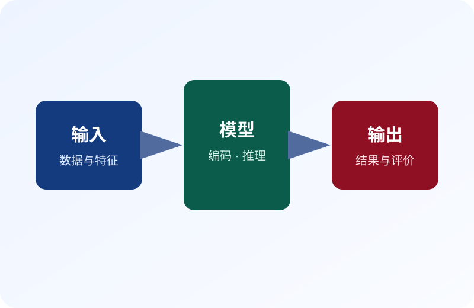
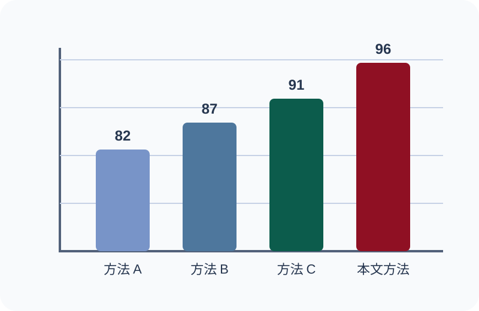

<!-- _class: title -->

# 面向复杂科研问题的多阶段建模与可信评估方法研究

## 从数据治理、模型推理到决策验证的统一框架

报告人姓名

2026年8月

研究机构 · 联合实验室

---

<!-- _class: toc -->

# 研究内容

- 问题定义与研究边界
- 数据治理与质量控制
- 模型设计与训练方法
- 实验验证与误差分析
- 部署效率与风险评估
- 结论、局限与展望

---

<!-- _class: long-title -->

# 跨来源异构数据条件下的模型可靠性、泛化能力与部署效率综合评估

## 长标题压力测试

本页检查三行以内的学术标题是否保持安全区，并确保标题与正文不重叠。

- 数据来源复杂，需要统一口径与质量控制。
- 模型链路较长，需要记录假设、参数和误差传播。
- 部署环境多样，需要同时评估精度、速度和资源占用。

---

# 四栏布局压力测试

### 数据

- 多源采集
- 异常清洗
- 标签核验

### 训练

- 特征构造
- 参数优化
- 稳定性测试

### 评估

- 精度对比
- 消融实验
- 误差分析

### 部署

- 模型压缩
- 性能监控
- 版本回滚

---

<!-- _class: small-text -->

# 密集表格压力测试

| 方法 | 准确率 | 召回率 | F1 | 参数量 | 延迟 | 显存 | 适用场景 |
|---|---:|---:|---:|---:|---:|---:|---|
| 基线 A | 89.3% | 87.8% | 88.5% | 12M | 18ms | 1.2GB | 轻量部署 |
| 基线 B | 91.6% | 90.2% | 90.9% | 35M | 31ms | 2.8GB | 通用任务 |
| 方法 C | 93.1% | 92.4% | 92.7% | 86M | 54ms | 5.1GB | 高精度场景 |
| 示例方法 | **95.8%** | **94.9%** | **95.3%** | 42M | 36ms | 3.2GB | 精度效率平衡 |

所有数字均为版式占位数据。

---

# 图文布局压力测试

### 架构说明

输入数据经过编码、推理与输出三个阶段。文字区包含一个短段落和四项说明，用于检查图片缩放与左右栏垂直对齐。

- 输入口径统一
- 中间状态可追踪
- 输出结果可解释
- 评价指标可复现

---

<!-- _class: timeline-centered -->

# 水平时间轴压力测试

阶段一

### 数据治理

统一来源与口径

阶段二

### 模型研发

完成训练与调优

阶段三

### 实验验证

开展对比与消融

阶段四

### 部署评估

检查效率与风险

---

# 大数字压力测试

95.8%

核心准确率

2.7×

推理加速

42M

模型参数量

18项

验证任务数

四项指标同时出现时，应保持标签简短，并确认数字、单位与统计口径一致。

---

<!-- _class: quote -->

> 一个可靠的研究结论，应明确说明成立条件、证据边界与可能失效的情形。

版式示例（非真实引文）

---

<!-- _class: image-slide with-title -->

# 全图页与标题叠层测试

图表说明：所有数字均为版式占位数据，仅用于检验全图布局。

---

<!-- _class: tinytext no-indent h3-compact -->

# 参考文献、紧凑标题与脚注

### 中文条目

1. 作者甲、作者乙：《用于检查中文参考文献换行与标点的示例题名》，《示例期刊》，2025年第3期。
2. 作者丙：《模型部署条件、数据边界与风险控制》，示例出版社，2022年。

### English entries

3. Author A, Author B. A representative paper title for checking long English references and line wrapping. Journal, 2024.
4. Author C et al. Dataset documentation and evaluation protocol for reproducible experiments, 2023.

压力测试：所有条目均为版式占位文本，不应作为真实来源使用。

---

<!-- _class: debug-layout -->

# 调试边界与自由分栏

### 左侧区域

自由分栏用于自定义比例。

### 右侧区域

调试模式显示布局边界。

导出前移除 `debug-layout`；此屏幕提示在打印样式中隐藏。

---

<!-- _class: thanks -->

# 感谢聆听

欢迎提问与交流
